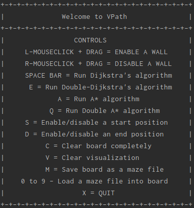
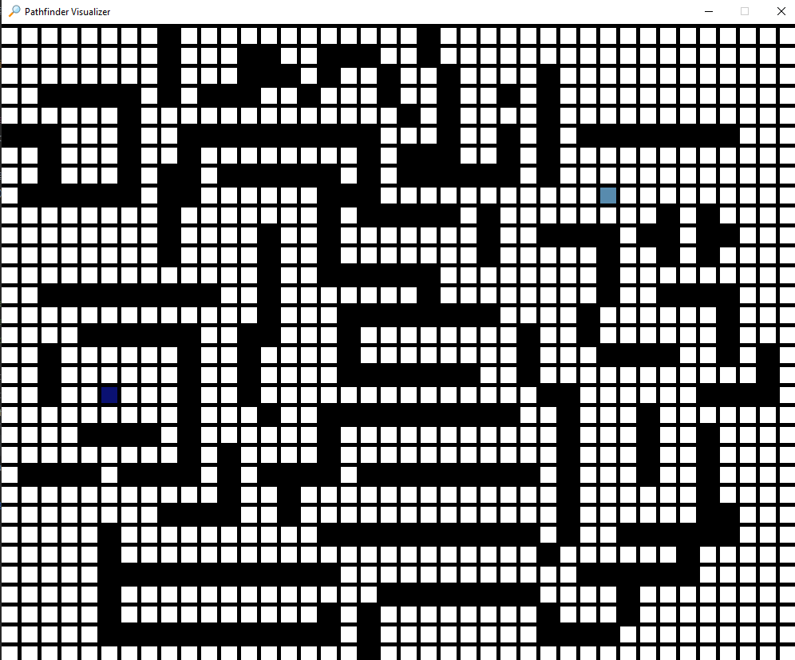
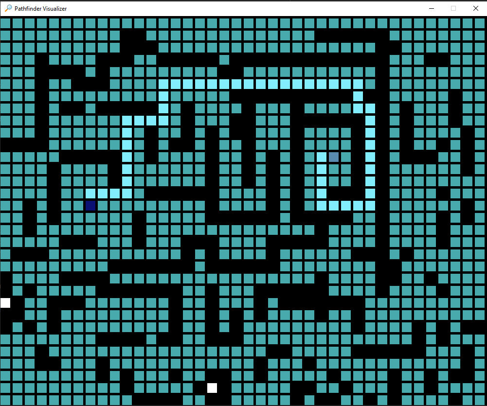
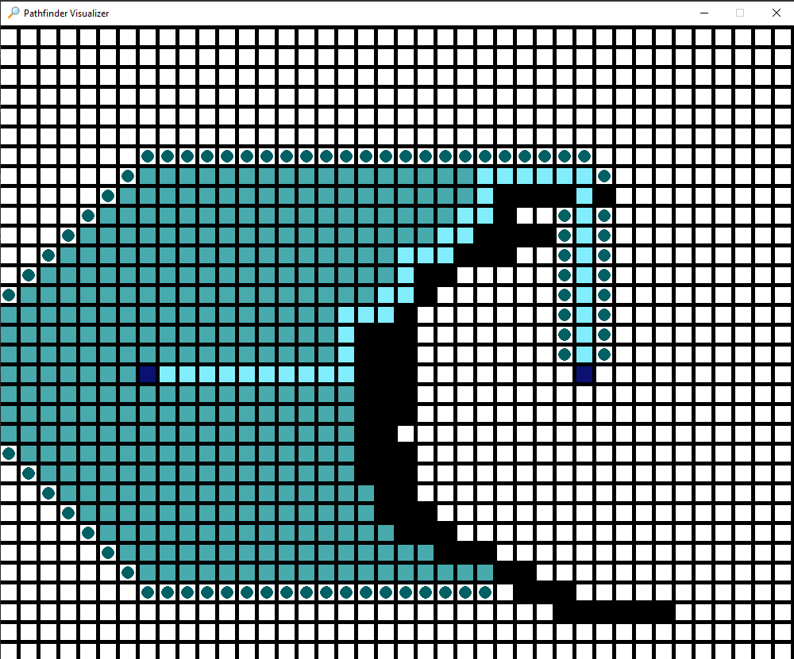

# VPath
This is a simple pathfinder visualization program that utilizes Dijkstra's algorithm and the optimized A* algorithm to display the shortest possible path to a destination node from a starting node.

## Background
### **Dijkstra's Algorithm**

> For a given source node in the graph, the algorithm finds the shortest path between that node and every other. It can also be used for finding the shortest paths from a single node to a single destination node by stopping the algorithm once the shortest path to the destination node has been determined.
> --<cite> [Wikipedia](https://en.wikipedia.org/wiki/Dijkstra%27s_algorithm) </cite>

### **A-star Algorithm**
> A* (pronounced as "A star") is a computer algorithm that is widely used in pathfinding and graph traversal. The algorithm efficiently plots a walkable path between multiple nodes, or points, on the graph.
> . . . However, the A* algorithm introduces a heuristic into a regular graph-searching algorithm, essentially planning ahead at each step so a more optimal decision is made. With A*, a robot would instead find a path in a way similar to the diagram on the right below.
> --<cite> [Brilliant](https://brilliant.org/wiki/a-star-search/) </cite>

## Instructions


## Usage
```shell
# Install the requirements
pip install -r requirements.txt
```

```python
# import play function from the VPath module
from VPath import play

# Plays the visualizer
play()
```

## Demonstration

### User made maze


### **Dijkstra's algorithm**
### In Progress

### Finished


### **A-star algorithm**
### In Progress


### Finished
