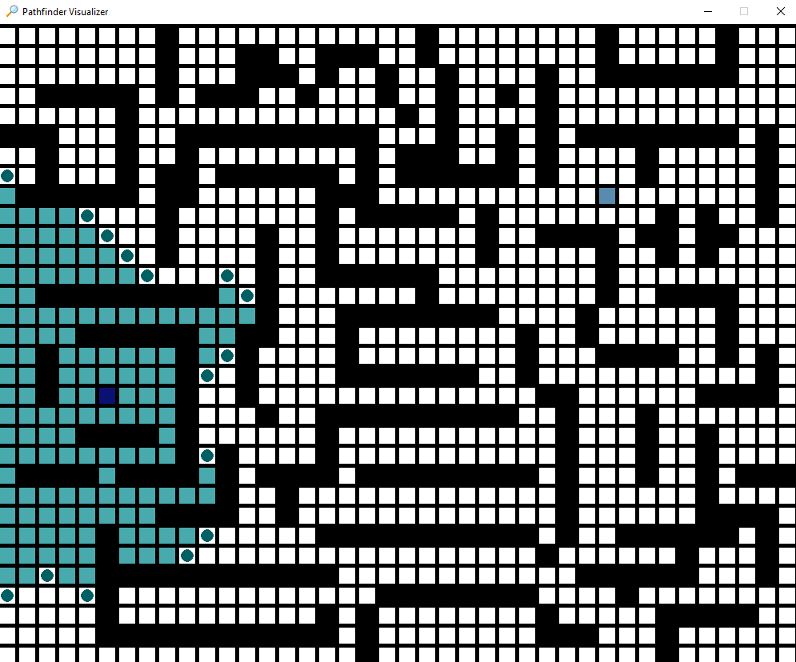
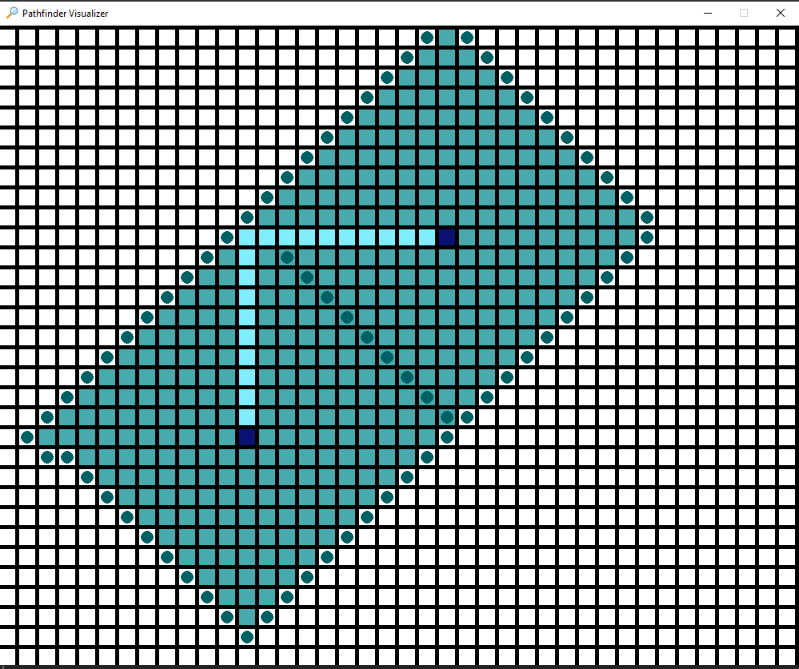
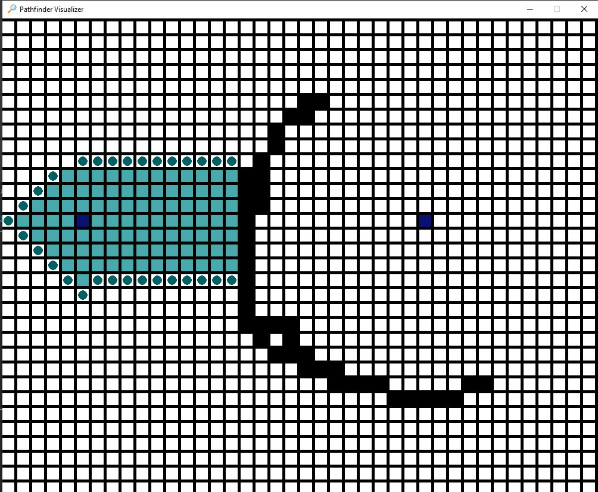

# VPath
This is an interactive and sleek pathfinder visualization program that utilizes a single and double-sourced Dijkstra's algorithm as well as the optimized A* algorithm to display the shortest possible path to a destination node from a starting node. 

Start and destination nodes are selected by the user, as well as wall nodes that they can use to develop mazes. For those who want to see VPath in action without making a comprehensive labyrinth of walls they can feel free to press any number from 1-9 to load a premade maze. Users also have the option to save mazes, but this can only be done by pressing the designated "save maze" key and waiting until after the program to designate what number and file to attribute to the maze, since the program is run within a single thread of execution. Further instructions and demonstrations can be found down below. Algorithm runtimes are also outputted in the terminal by default after each pathfinding execution, however they can be turned off by removing their decorators.

## Background
### **Dijkstra's Algorithm**

> For a given source node in the graph, the algorithm finds the shortest path between that node and every other. It can also be used for finding the shortest paths from a single node to a single destination node by stopping the algorithm once the shortest path to the destination node has been determined.
> --<cite> [Wikipedia](https://en.wikipedia.org/wiki/Dijkstra%27s_algorithm) </cite>

### **A-star Algorithm**
> A* (pronounced as "A star") is a computer algorithm that is widely used in pathfinding and graph traversal. The algorithm efficiently plots a walkable path between multiple nodes, or points, on the graph.
> . . . However, the A* algorithm introduces a heuristic into a regular graph-searching algorithm, essentially planning ahead at each step so a more optimal decision is made. With A*, a robot would instead find a path in a way similar to the diagram on the right below.
> --<cite> [Brilliant](https://brilliant.org/wiki/a-star-search/) </cite>

## Instructions


## Usage
```shell
# Install the requirements
pip install -r requirements.txt
```

```python
# import play function from the VPath module
from VPath import play

# Plays the visualizer
play()
```

## Demonstration

### User made maze


### **Dijkstra's algorithm (single)**
### In Progress

### Finished


### **Dijkstra's algorithm (double)**
### In Progress


### Finished


### **A-star algorithm**
### In Progress


### Finished


## Usage tips
* It is recommended to avoid pressing multiple keys during the solving phase as it will queue up the instructions and execute them after the solving phase immediately unless that is what is intended by the user.
* In the event the game freezes simply quit the program and try restarting as this can happen when too many keys are pressed
* The color of the pathfinder can be modified by changing the COLORS dictionary at the top of game.py
* The delay of the pathfinder can also be reduced by changing DELAY at the top of game.py
* To deselect a start/destination node be sure to hover over them directly
